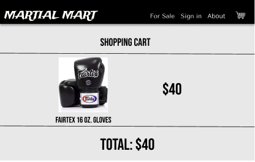
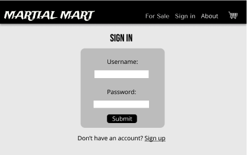
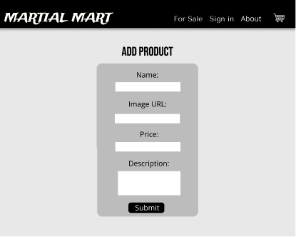
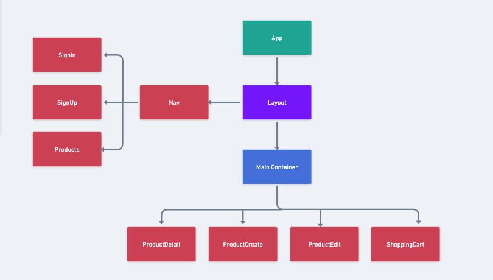

# Martial-Mart

## Overview
Martial-Mart is a full-stack app that allows users to buy and sell martial arts gear

## MVP

### Goals

- Include authentication, allow any user to browse selection, but only add or edit products when signed in
- Full CRUD on products for users
- 8 React components

### Libraries and Dependcies
|     Library      | Description                                |
| :--------------: | :----------------------------------------- |
|      React       | Front-end website design |
|   React Router   | Allows to create links that lead the user to other pages within site |
| Postgresql | Database construction and manipulation |
| Ruby on Rails| Create back-end that uses postgresql to render information for site |
|  Axios  | Makes calls to back-end from react to render data |
### Client (Front End)

#### Wireframes

#### Component Tree

#### Component Architecture

src
|_ screens/
      |_ Homepage.jsx
      |_ Products.jsx
      |_ ProductDetail.jsx
      |_ SignIn.jsx
      |_ SignUp.jsx
      |_ ProductCreate.jsx
      |_ ShoppingCart.jsx
|_ components/
      |_ ItemContainer.jsx
      |_ Layout.jsx
      |_ Header.jsx
      |_ Nav.jsx
      |_ Footer.jsx
      |_ Products.jsx
      |_ ProductDetail.jsx
      |_ Product.jsx
      |_ ShoppingCart.jsx

#### Time Estimates

### Server (Back End)

#### ERD Model

## Post-MVP

