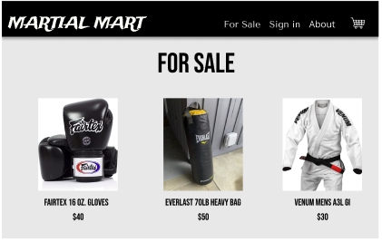
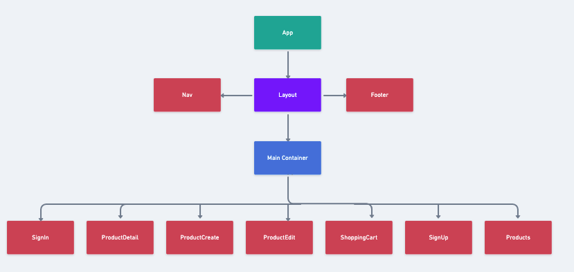

# Martial-Mart

## Overview

Martial-Mart is a full-stack app that allows users to buy and sell martial arts gear

## MVP

### Goals

- Include authentication, allow any user to browse selection, but only add or edit products when signed in
- Full CRUD on products for users
- 8 React components

### Libraries and Dependcies

|    Library    | Description                                                          |
| :-----------: | :------------------------------------------------------------------- |
|     React     | Front-end website design                                             |
| React Router  | Allows to create links that lead the user to other pages within site |
|  Postgresql   | Database construction and manipulation                               |
| Ruby on Rails | Create back-end that uses postgresql to render information for site  |
|     Axios     | Makes calls to back-end from react to render data                    |

### Client (Front End)

#### Wireframes

https://www.figma.com/file/qvzTtvAJxLEyNtu4kOVxyR/Martial-Mart?node-id=0%3A1





#### Component Tree



https://whimsical.com/martial-mart-M9m6N3GgTWUYGFwDcRLntd

#### Component Architecture

```structure
src
|_ screens/
      |_ Homepage.jsx
      |_ Products.jsx
      |_ ProductDetail.jsx
      |_ SignIn.jsx
      |_ SignUp.jsx
      |_ ProductCreate.jsx
      |_ ShoppingCart.jsx
|_ components/
      |_ ItemContainer.jsx
      |_ Layout.jsx
      |_ Header.jsx
      |_ Nav.jsx
      |_ Footer.jsx
      |_ Products.jsx
      |_ ProductDetail.jsx
      |_ Product.jsx
      |_ ShoppingCart.jsx
```

#### Time Estimates

| Task                     | Priority | Estimated Time | Time Invested |
| ------------------------ | :------: | :------------: | :-----------: | 
| Add Contact Form         |    L     |     3 hrs      |       2        |
| Create CRUD Actions      |    H     |     3 hrs      |        2       |           
| Endpoints                |    H     |     3 hrs      |        3       |             
| Auth                     |    H     |     3 hrs      |        2       |             
| Seed DB                  |    H     |     2 hrs      |        1       |             
| File structure           |    H     |     1 hrs      |        1       |             
| Set up auth on front end |    H     |     3 hrs      |        2       |             
| Homepage                 |    H     |     2 hrs      |        2       |             
| Products Page            |    H     |     3 hrs      |        3       |             
| Product Details Page     |    H     |     3 hrs      |2  |                              
| Product Create Page      |    H     |     2 hrs      |     2     |             
| Product Details Page     |    H     |     3 hrs      |    3 |                        
| CSS                      |    H     |     10 hrs     |        12       |             
| Media Queries            |    H     |     2 hrs      |        3       |             

| TOTAL | | 52 hrs | 40 | 

### Server (Back End)

#### ERD Model


https://app.diagrams.net/#G1_OyP7GdOPuKXK15jClAhox_TlebAi2ng

## Post-MVP

- Hamburger Menu for mobile
- Shopping Cart
- Add CSS animations
- Carousel for homepage
